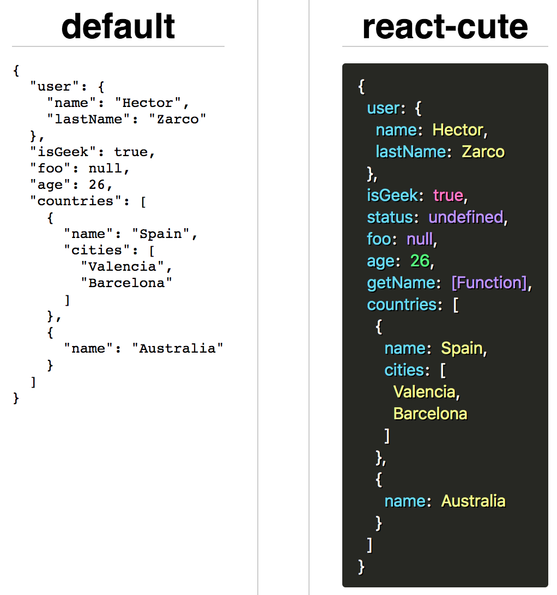

# react-cute [](https://travis-ci.org/zzarcon/react-cute)
> Cute JSON's in React

<div align="center">
  
  <br><br>
</div>

# Demo 👀
  [https://zzarcon.github.io/react-cute](https://zzarcon.github.io/react-cute)

# Install 🚀
  ```
  $ yarn add react-cute
  ```

# Usage ⛏

**Basic**

```jsx
import Cute from 'react-cute';

const json = {
  name: 'hector',
  twitter: '@zzarcon'
};

<Cute json={json} />
```

**Custom**

```tsx
import Cute from 'react-cute';

const json = {
  name: 'hector',
  twitter: '@zzarcon'
};

const color = {
  string: '#fff',
  number: '#000000',
  function: 'rgb(255, 255, 255)',
  boolean: 'rgba(0, 0, 0, 0.5)',
  null: 'red',
  undefined: 'hsl(30, 100%, 50%, 0.6)',
  key: 'hsla(30, 100%, 50%, 0.6)',
  colon: 'initial',
}

<Cute json={json} color={color} />
```

# Features ✨
  * Out of the box UI
  * Different colors based on value type
  * Render values not showed by default
  * Dependency free + no external CSS
  * [3kB size](https://bundlephobia.com/result?p=react-cute)

# Author 👶
  [@zzarcon](https://twitter.com/zzarcon) 
